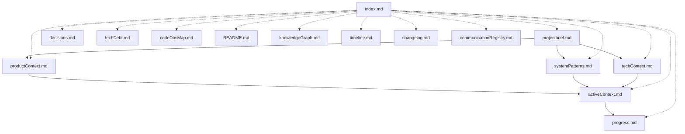

# FRC4D Memory Bank

This Memory Bank serves as the central documentation repository for the FRC4D project. It contains structured documents that capture all aspects of the project, from requirements to implementation details and progress.

## Purpose

The Memory Bank is designed to:

1. Provide a single source of truth for project information
2. Track project progress and decisions
3. Maintain historical context for all aspects of the project
4. Enable efficient knowledge transfer and onboarding
5. Support continuous improvement through documented learning

## Structure

The Memory Bank follows a hierarchical structure with core files building upon each other:

### Core Files

- [**Project Brief**](projectbrief.md): Foundation document defining requirements and goals
- [**Product Context**](productContext.md): Why this project exists and problems it solves
- [**Active Context**](activeContext.md): Current work focus, recent changes, and next steps
- [**System Patterns**](systemPatterns.md): System architecture and key technical decisions
- [**Technical Context**](techContext.md): Technologies used, setup, and dependencies
- [**Progress**](progress.md): What works, what's in progress, and what's left to build

### Navigation and Reference

- [**Index**](index.md): Quick navigation to all Memory Bank documents

### Specialized Documentation

- **Decisions**: Records key technical and architectural decisions (to be created)
- **Technical Debt**: Tracks known technical debt and limitations (to be created)
- **Code Documentation Map**: Maps code files to documentation (to be created)
- **Knowledge Graph**: Visual representation of project relationships (to be created)
- **Timeline**: Visual project timeline with milestones (to be created)
- **Changelog**: Record of all significant document changes (to be created)
- **Communication Registry**: Records documentation update communications (to be created)

## Usage

### Starting Work

1. Begin by reading the [Index](index.md) for a quick overview
2. Review [Active Context](activeContext.md) to understand current focus
3. Check [Progress](progress.md) for implementation status
4. Refer to specific documents as needed for deeper context

### During Development

1. Reference [System Patterns](systemPatterns.md) when implementing features
2. Consult [Technical Context](techContext.md) for technical environment details
3. Check Decisions (when created) before making significant technical changes
4. Review Technical Debt (when created) when working on improvements

### Ending Work

1. Update [Active Context](activeContext.md) with recent changes and next steps
2. Update [Progress](progress.md) with new status information
3. Document any new decisions in Decisions (when created)
4. Record any new technical debt in Technical Debt (when created)

## Maintenance

The Memory Bank should be kept current with:

1. Regular updates to reflect project progress
2. Documentation of all significant decisions
3. Clear tracking of what works and what needs to be built
4. Current focus areas and next steps

## Status Tags

Documents use status tags to indicate their currency:

- **[CURRENT]**: Document is up-to-date
- **[NEEDS UPDATE]**: Document needs to be updated
- **[DEPRECATED]**: Document is no longer relevant but kept for reference
- **[DRAFT]**: Document is in draft state and not finalized
- **[REVIEW]**: Document ready for review
- **[PENDING APPROVAL]**: Document updated and awaiting approval